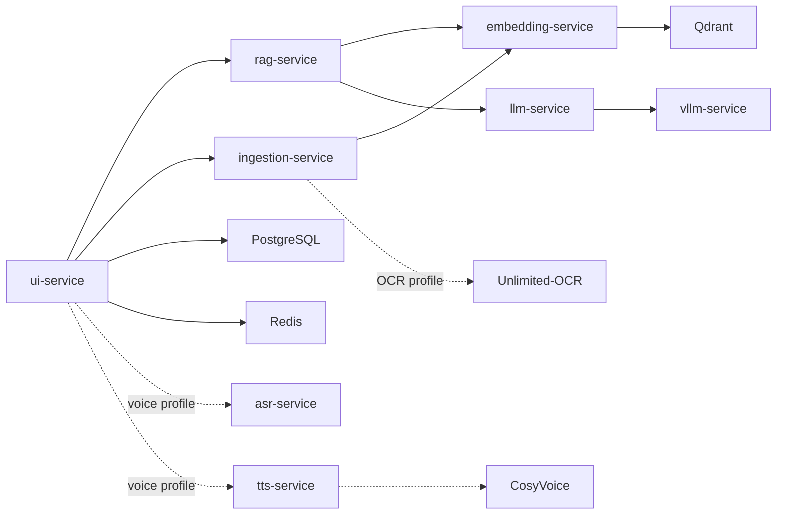

# RAG Production

Многопользовательская RAG-система для работы с личными и общими документами. Пользователь загружает документы, задаёт вопросы и получает ответы с источниками; администратор управляет пользователями, общими базами знаний, голосовым режимом и обратной связью.

## Возможности

- Изоляция данных: личные документы находятся в `user:{username}`, общие документы - в `global`.
- PostgreSQL для пользователей, ролей, админ-аудита и feedback.
- Redis для сессий, refresh-token revocation, истории и cache.
- Qdrant для векторного поиска с метаданными документа: заголовок, раздел, дата и тип файла.
- RAG-ответы с цитатами вида `[filename]`, streaming и feedback `полезно / не полезно`.
- Админ-API для просмотра отрицательного feedback и выгрузки evaluation-кейсов.
- Optional OCR для личных сканов на базе Baidu Unlimited-OCR.
- Optional голосовой разговор: browser VAD, ASR, RAG streaming и CosyVoice TTS.

## Архитектура



## Быстрый старт

1. Создайте локальный `.env` на основе `.env.example`.
2. Укажите надёжные значения для `POSTGRES_PASSWORD`, `SECRET_KEY` и `INTERNAL_SERVICE_TOKEN`.
3. Запустите основной стек:

```bash
docker compose up --build
```

4. Откройте [http://localhost:8000](http://localhost:8000).

Первый запуск скачивает модели embedding и LLM, поэтому может занять время. UI доступен на `8000`, Prometheus - на `9090`, Grafana - на `3000`.

## Пользователи и доступ

В системе две роли:

| Роль | Возможности |
| --- | --- |
| `user` | Свои сессии, личная база знаний и общая база для поиска. |
| `admin` | Управление пользователями, общими документами, базами знаний, feedback и настройками голоса. |

Пользователь не может просматривать, удалять или использовать в поиске документы другого пользователя. Админ-действия записываются в `admin_audit_logs`.

## Документы и поиск

Поддерживаются `PDF`, `DOCX`, `TXT`, `MD`, `PNG`, `JPG`, `JPEG` и `WebP`.

- Обычный текст из PDF и DOCX извлекается нативно.
- Документ индексируется вместе с метаданными: title, section, date, file type, scope и owner.
- Поиск использует vector retrieval, keyword boost, reranking и фильтрацию по scope.
- Ответы показывают источники, а feedback сохраняет вопрос, ответ и выбранные источники.

## 1C ZUP Search

The `superuser` role is assigned only by an administrator. It gives access to protected employee search through the configured 1C ZUP API but does not grant user administration, document management, or system settings access. Employee data is not indexed in RAG and is not cached by the application.

Set `ZUP_API_BASE_URL`, `ZUP_EMPLOYEES_PATH`, `ZUP_SEARCH_PARAM`, and the 1C authentication values in `.env`. The supplied workbook documents fields but not the live endpoint, so these values must match the published 1C HTTP/OData API. Details: [docs/zup-api.md](docs/zup-api.md).

## OCR для сканов

OCR является отдельным GPU-профилем и не запускается при обычном `docker compose up`.

В `.env`:

```dotenv
OCR_ENABLED=true
OCR_MAX_PAGES=20
OCR_RENDER_DPI=150
```

Запуск:

```bash
docker compose --profile ocr up --build
```

Unlimited-OCR вызывается только когда пользователь загружает непустой личный PDF или image-файл, а нативное извлечение текста вернуло пустой результат. Общие документы и файлы с уже извлечённым текстом в OCR не отправляются. Детали: [docs/unlimited-ocr.md](docs/unlimited-ocr.md).

## Голосовой режим

Голосовой режим также опционален и требует NVIDIA GPU:

```bash
docker compose --profile voice up --build
```

Пользователь открывает голосовой режим из чата. Браузер передаёт временные WebSocket-аудиочанки, VAD завершает фразу после паузы, ASR получает текст, а RAG и CosyVoice возвращают потоковый ответ и PCM-аудио. Микрофонные данные не сохраняются; transcript и ответ остаются в принадлежащей пользователю сессии.

Администратор включает этот режим и задаёт один общий голос в панели `Голос`: SFT speaker ID или zero-shot WAV-референс. Детали: [docs/voice-mode.md](docs/voice-mode.md).

## Конфигурация

Основные переменные:

| Переменная | Назначение |
| --- | --- |
| `POSTGRES_PASSWORD` | Пароль PostgreSQL. Обязателен. |
| `SECRET_KEY` | Ключ подписи cookies. Обязателен для production. |
| `INTERNAL_SERVICE_TOKEN` | Токен внутренних запросов между сервисами. Обязателен. |
| `LLM_PROVIDER` | `ollama` или `vllm`. |
| `VLLM_HF_MODEL` | Hugging Face модель для `vllm-service`. |
| `EMBEDDING_MODEL` | Модель embedding, по умолчанию `BAAI/bge-m3`. |
| `MAX_FILE_SIZE` | Максимальный размер загрузки в MB. |
| `OCR_ENABLED` | Включает OCR fallback при запуске профиля `ocr`. |
| `ASR_MODEL` | Модель faster-whisper для профиля `voice`. |
| `COSYVOICE_MODEL` | Модель CosyVoice для профиля `voice`. |

Полный шаблон находится в [.env.example](.env.example).

## Проверка и CI

```bash
pytest -q
docker compose config --quiet
```

GitHub Actions запускает тесты для UI, RAG, ingestion, OCR, ASR и TTS-адаптеров на push и pull request.

## Структура

```text
ui-service/          Web UI, auth, admin API, WebSocket voice orchestration
rag-service/         Retrieval, ranking, prompt orchestration, streaming
embedding-service/   Embeddings and Qdrant integration
ingestion-service/   Parsing, metadata, chunking and indexing
llm-service/         LLM provider adapter
ocr-service/         Unlimited-OCR adapter
asr-service/         faster-whisper transcription service
tts-service/         CosyVoice streaming adapter
cosyvoice-service/   Upstream CosyVoice container build
docs/                OCR and voice-mode operational notes
```

## Production notes

- Не публикуйте порты Qdrant, Redis, PostgreSQL, ASR, OCR и TTS наружу без отдельной сетевой защиты.
- Используйте HTTPS и `AUTH_COOKIE_SECURE=true` за reverse proxy.
- GPU-сервисы конкурируют за память. Включайте `ocr` и `voice` только на машинах с достаточной VRAM либо распределяйте их по разным GPU.
- Перед использованием zero-shot голоса получите разрешение владельца голосового референса.
