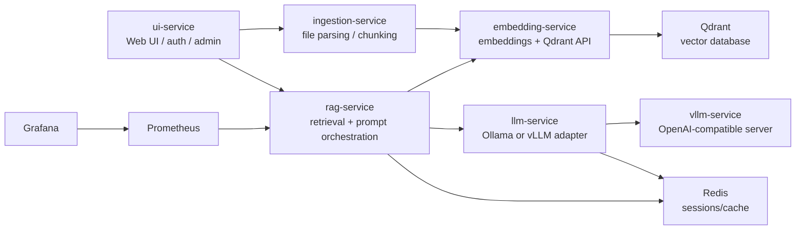

# RAG Production

Микросервисная RAG-система для загрузки документов, построения векторной базы знаний и общения с LLM на основе найденного контекста. Проект разворачивается через Docker Compose и включает веб-интерфейс, сервис ingestion, сервис эмбеддингов, RAG-оркестратор, LLM-адаптер, Qdrant, Redis, Prometheus и Grafana.

## Что реализовано

- Веб-интерфейс чата с авторизацией, регистрацией, ролями `admin` и `user`.
- Загрузка документов в форматах `PDF`, `DOCX`, `TXT`, `MD`.
- Извлечение текста из файлов и разбиение на чанки с overlap.
- Индексация чанков в Qdrant через embedding-модель.
- Поиск по личной и глобальной базе знаний.
- RAG-pipeline с векторным поиском, keyword scoring, гибридной сортировкой, deduplication, rerank и ограничением контекста.
- Поддержка streaming-ответов в формате `application/x-ndjson`.
- Кеширование LLM-ответов и RAG-ответов в Redis.
- Хранение истории диалогов по `session_id`.
- Soft delete документов и пользовательских scope в векторной базе.
- Админские API для управления пользователями, документами и базами знаний.
- Healthcheck endpoints для всех сервисов.
- Prometheus-метрики для RAG-сервиса и Grafana для визуализации.

## Архитектура



## Сервисы и порты

| Сервис | Порт | Назначение |
| --- | ---: | --- |
| `ui-service` | `8000` | Веб-интерфейс, авторизация, чат, загрузка файлов, админ-панель |
| `embedding-service` | `8001` | Генерация эмбеддингов, индексация, поиск, управление документами в Qdrant |
| `llm-service` | `8002` | Единый API генерации для Ollama или vLLM, cache и streaming |
| `rag-service` | `8003` | RAG-оркестратор: retrieval, ranking, prompt, sources, metrics |
| `ingestion-service` | `8004` | Загрузка файлов, извлечение текста, chunking, отправка на индексацию |
| `vllm-service` | `8005 -> 8000` | OpenAI-compatible vLLM server |
| `qdrant` | `6333` | Векторная база данных |
| `redis` | `6379` | Кеш и память сессий |
| `prometheus` | `9090` | Сбор метрик |
| `grafana` | `3000` | Дашборды мониторинга |

## Технологии

- Python 3.11
- FastAPI, Uvicorn
- Jinja2 templates, HTML/CSS frontend
- Docker, Docker Compose
- Qdrant vector database
- Redis
- Sentence Transformers
- Embedding model по умолчанию: `BAAI/bge-m3`
- vLLM OpenAI-compatible server
- Ollama-compatible генерация через `/api/generate`
- httpx async client
- pypdf, python-docx
- NumPy
- Prometheus client, Prometheus, Grafana

## Основные компоненты

### ui-service

Веб-интерфейс системы. Отвечает за:

- страницу логина и основную страницу чата;
- регистрацию и вход пользователей;
- JWT-like access/refresh cookies на HMAC SHA-256;
- роли `admin` и `user`;
- загрузку документов в личную или глобальную базу;
- отправку вопросов в RAG;
- обычные и streaming-ответы;
- просмотр истории сессий;
- управление пользователями, документами и базами знаний для администратора;
- проверку статусов backend-сервисов.

Основные маршруты:

- `GET /` - интерфейс чата или страница входа;
- `POST /login`, `POST /register`, `POST /refresh`, `POST /logout`;
- `POST /ask` - обычный RAG-запрос;
- `POST /ask/stream` - streaming RAG-запрос;
- `POST /upload` - загрузка документа;
- `GET /api/documents` - список документов;
- `GET /api/sessions`, `POST /api/session/new`, `GET /api/session/{session_id}/history`;
- `GET /api/admin/users`, `POST /api/admin/users`, `PATCH /api/admin/users/{username}`, `DELETE /api/admin/users/{username}`;
- `GET /api/admin/databases`, `GET /api/admin/documents`, `DELETE /api/admin/documents/{document_id}`.

### ingestion-service

Сервис загрузки и подготовки документов:

- принимает файл через multipart form;
- поддерживает `pdf`, `docx`, `txt`, `md`;
- извлекает текст из PDF через `pypdf`;
- извлекает текст из DOCX через `python-docx`;
- нормализует текст;
- режет текст на чанки размером около `800` символов с overlap `100`;
- вычисляет детерминированный `document_id` через SHA-256 содержимого файла;
- отправляет чанки в `embedding-service` на индексацию.

Основные маршруты:

- `GET /health`;
- `POST /upload`.

### embedding-service

Сервис эмбеддингов и работы с Qdrant:

- загружает SentenceTransformer модель;
- генерирует normalized embeddings;
- автоматически создает Qdrant collection;
- создает payload indexes для `document_id`, `is_deleted`, `scope_key`, `owner_username`, `knowledge_base`;
- индексирует документы идемпотентно: перед повторной индексацией удаляет старые чанки документа в рамках scope;
- выполняет vector search;
- поддерживает разделение данных по `scope_key`;
- поддерживает soft delete документов и scope.

Основные маршруты:

- `GET /health`;
- `POST /embed`;
- `POST /index`;
- `POST /search`;
- `GET /documents`;
- `POST /documents/{document_id}/delete`;
- `POST /scope/{scope_key}/delete`;
- `POST /documents/{document_id}/reindex`.

### rag-service

RAG-оркестратор. Собирает финальный ответ на основе контекста из векторной базы:

- принимает вопрос, `session_id`, `top_k`, `scope_keys`;
- использует Redis для истории диалога и semantic cache;
- строит поисковые запросы;
- вызывает `embedding-service` для поиска;
- удаляет дубликаты найденных чанков;
- считает keyword score;
- объединяет vector score и keyword score в hybrid score;
- фильтрует результаты по threshold;
- делает rerank;
- ограничивает размер контекста;
- опционально поддерживает query expansion, compression и grounding check через env flags;
- формирует prompt с запретом выдумывать факты;
- вызывает `llm-service`;
- возвращает ответ и sources;
- поддерживает streaming;
- публикует Prometheus-метрики.

Основные маршруты:

- `GET /health`;
- `GET /metrics`;
- `POST /ask`;
- `POST /ask/stream`.

### llm-service

Единый адаптер генерации текста:

- работает с Ollama-compatible API или vLLM OpenAI-compatible API;
- выбирает provider через `LLM_PROVIDER`;
- поддерживает `stream=true`;
- кеширует ответы в Redis;
- ограничивает параллельность генерации;
- поддерживает retry для Ollama;
- поддерживает fallback model для Ollama.

Основные маршруты:

- `GET /health`;
- `POST /generate`.

## Базы знаний и права доступа

В проекте реализовано разделение документов по scope:

- `global` - общая база знаний;
- `user:{username}` - личная база знаний пользователя.

Пользователь видит глобальную базу и свою личную базу. Администратор может просматривать все документы, управлять пользователями, документами и базами знаний.

## Переменные окружения

Основные переменные, используемые проектом:

| Переменная | Назначение |
| --- | --- |
| `QDRANT_HOST`, `QDRANT_PORT` | Подключение к Qdrant |
| `COLLECTION_NAME` | Имя коллекции Qdrant, по умолчанию `documents` |
| `EMBEDDING_MODEL` | SentenceTransformer модель, по умолчанию `BAAI/bge-m3` |
| `EMBEDDING_BATCH_SIZE`, `EMBEDDING_CONCURRENCY` | Batch size и параллельность embedding-service |
| `LLM_PROVIDER` | Provider генерации: `ollama` или `vllm` |
| `LLM_MODEL`, `REASON_MODEL`, `FAST_MODEL`, `FINAL_MODEL`, `FALLBACK_MODEL` | Модели для генерации и fallback |
| `OLLAMA_URL` | Ollama-compatible endpoint |
| `VLLM_BASE_URL`, `VLLM_MODEL` | vLLM OpenAI-compatible endpoint и served model |
| `VLLM_HF_MODEL`, `VLLM_SERVED_MODEL_NAME` | HF-модель и имя модели для vLLM container |
| `VLLM_GPU_MEMORY_UTILIZATION`, `VLLM_MAX_MODEL_LEN`, `VLLM_MAX_NUM_SEQS` | Настройки vLLM runtime |
| `REDIS_HOST`, `REDIS_PORT` | Подключение к Redis |
| `RAG_SCORE_THRESHOLD`, `RAG_SEMANTIC_THRESHOLD` | Пороги фильтрации и grounding check |
| `RAG_SEARCH_CANDIDATES`, `RAG_FINAL_TOP_K` | Количество кандидатов и финальных источников |
| `RAG_MAX_CONTEXT_CHARS`, `RAG_MAX_ANSWER_TOKENS` | Ограничения контекста и ответа |
| `RAG_ENABLE_COMPRESSION`, `RAG_ENABLE_QUERY_EXPANSION`, `RAG_ENABLE_GROUNDING_CHECK` | Опциональные RAG-функции |
| `RAG_CACHE_TTL` | TTL кеша RAG-ответов |
| `REQUEST_TIMEOUT` | Общий timeout HTTP-запросов |
| `SECRET_KEY` | Ключ подписи auth cookies |
| `UI_USERS_JSON`, `UI_USERS_FILE` | Источник пользователей UI |
| `MAX_FILE_SIZE` | Максимальный размер файла в MB |
| `AUTH_COOKIE_SECURE` | Secure-флаг cookies |

## Запуск

1. Создать или проверить файл `.env`.
2. Запустить stack:

```bash
docker compose up --build
```

3. Открыть UI:

```text
http://localhost:8000
```

4. Проверить отдельные сервисы:

```text
http://localhost:8001/health
http://localhost:8002/health
http://localhost:8003/health
http://localhost:8004/health
```

Prometheus доступен на `http://localhost:9090`, Grafana - на `http://localhost:3000`.

## Примеры API

### Загрузка документа

```bash
curl -X POST http://localhost:8004/upload \
  -F "file=@document.pdf" \
  -F "scope_key=global" \
  -F "knowledge_base=global"
```

### Поиск по векторной базе

```bash
curl -X POST http://localhost:8001/search \
  -H "Content-Type: application/json" \
  -d '{"query":"Что описано в документе?","top_k":5,"scope_keys":["global"]}'
```

### RAG-вопрос

```bash
curl -X POST http://localhost:8003/ask \
  -H "Content-Type: application/json" \
  -d '{"question":"Что описано в документе?","session_id":"demo","top_k":5,"scope_keys":["global"]}'
```

### Streaming RAG-вопрос

```bash
curl -N -X POST http://localhost:8003/ask/stream \
  -H "Content-Type: application/json" \
  -d '{"question":"Кратко перескажи документ","session_id":"demo","top_k":5,"scope_keys":["global"]}'
```

## Мониторинг

`rag-service` экспортирует метрики на `/metrics`:

- `rag_requests_total`;
- `rag_pipeline_latency_seconds`;
- `vector_search_latency_seconds`;
- `llm_latency_seconds`.

Prometheus настроен в `prometheus.yml` и собирает метрики с `rag-service:8003`.

## Структура проекта

```text
.
├── docker-compose.yml
├── prometheus.yml
├── rag_graf.json
├── qdrant_data/
├── embedding-service/
│   ├── app/main.py
│   ├── app/model.py
│   └── app/qdrant_client.py
├── ingestion-service/
│   └── app/main.py
├── llm-service/
│   └── app/main.py
├── rag-service/
│   └── app/main.py
└── ui-service/
    ├── app/main.py
    ├── templates/
    └── static/
```

## Важные замечания

- В `ui-service` в коде есть дефолтные пользователи `admin/admin123` и `user/user123`. Для production нужно переопределить пользователей через `UI_USERS_JSON` или `UI_USERS_FILE` и задать надежный `SECRET_KEY`.
- `qdrant_data/` содержит локальные данные Qdrant и подключен как volume.
- `vllm-service` в `docker-compose.yml` использует GPU через `gpus: all`.
- По умолчанию `llm-service` настроен как адаптер, который может работать с Ollama или vLLM в зависимости от `LLM_PROVIDER`.
