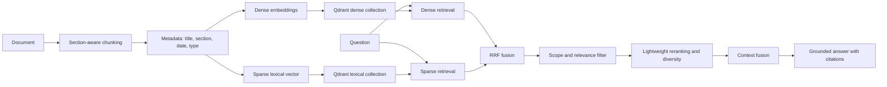

# Advanced RAG

The retrieval pipeline uses both semantic and lexical evidence while preserving
the existing personal-document and global-document scope filters.

## Retrieval stages

1. **Dense retrieval** finds semantically similar chunks using the configured
   embedding model.
2. **Sparse retrieval** finds exact terms, identifiers, file names, headings,
   and domain vocabulary. Title, section, and filename tokens receive a small
   boost during indexing.
3. **RRF fusion** rewards chunks that both retrieval channels agree on, without
   requiring their score scales to match.
4. **Filtering and reranking** discard weak candidates, limit repeated chunks
   from one document, and use MMR-style diversity to keep the context useful.
5. **Context fusion** joins selected chunks from the same document under one
   stable citation label. The LLM receives only this evidence and is instructed
   to cite factual claims as `[filename]`.

## Operations

- `documents` remains the existing dense Qdrant collection.
- `documents_lexical` is created automatically for sparse vectors. Override
  its name with `LEXICAL_COLLECTION_NAME` when needed.
- Documents uploaded after this change are indexed in both collections.
  Re-upload existing documents once to add them to the lexical collection; the
  dense collection keeps serving those documents until then.
- `RAG_SPARSE_SCORE_THRESHOLD` controls the lexical relevance floor.
  `RAG_RRF_K` controls fusion smoothness. `RAG_MMR_LAMBDA` balances relevance
  against duplicate context.
