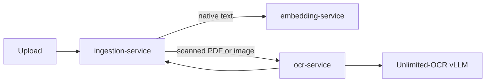

# Unlimited-OCR Integration

This project uses [Baidu Unlimited-OCR](https://github.com/baidu/Unlimited-OCR) as an optional internal OCR service for scanned PDFs and uploaded PNG, JPEG, and WebP images.

Native PDF and DOCX extraction remains the fast default. OCR is considered only for a nonempty private PDF or supported image when native extraction returns no text at all. Shared documents and documents with any native text never trigger OCR.

## Start the OCR Profile

An NVIDIA GPU is required by the upstream vLLM deployment. Set the following in `.env`:

```dotenv
OCR_ENABLED=true
OCR_MAX_PAGES=20
OCR_RENDER_DPI=150
OCR_MAX_TOKENS=32768
```

Start the normal stack and the optional OCR profile together:

```bash
docker compose --profile ocr up --build
```

The first startup downloads `baidu/Unlimited-OCR`. The OCR container is not published on a host port: it is reachable only by `ingestion-service` and uses the existing `INTERNAL_SERVICE_TOKEN` header.

## Architecture



The adapter renders PDF pages to PNG and sends them to the model through the OpenAI-compatible vLLM chat-completions endpoint. It applies the model-specific n-gram logits processor, disables prefix caching, and returns cleaned document text for the existing metadata and indexing pipeline.
