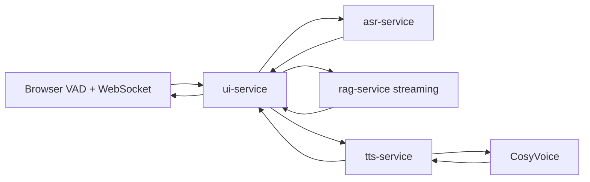

# Voice Mode

Voice mode is an optional, authenticated, multi-user conversation surface. It uses the browser WebSocket connection for ephemeral audio chunks and never persists user microphone data.



## Run

Voice services are isolated behind the `voice` Compose profile and need an NVIDIA GPU:

```bash
docker compose --profile voice up --build
```

The first build fetches the upstream `FunAudioLLM/CosyVoice` repository. The first model startup can also download the configured CosyVoice and Whisper models.

## Administration

An administrator opens the `Voice` tab in the existing admin panel and configures one shared voice:

- enable or disable voice mode for all users;
- choose the CosyVoice `SFT` speaker ID; or
- switch to `zero_shot` and upload the single administrator-owned reference audio plus its transcript.

The administrator reference is stored only inside the `tts_data` Docker volume. User microphone chunks are held in memory by `ui-service`; ASR uses a temporary decode file and removes it immediately after transcription. Text transcripts and answers are retained in the existing user-owned chat session.
